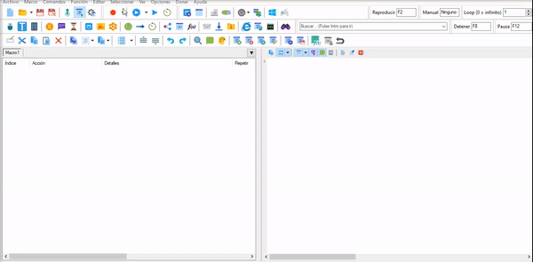
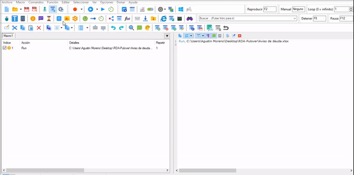
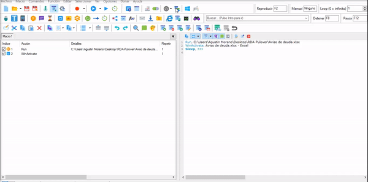
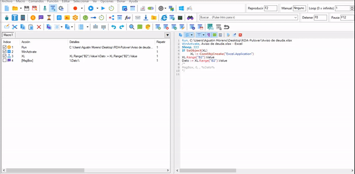
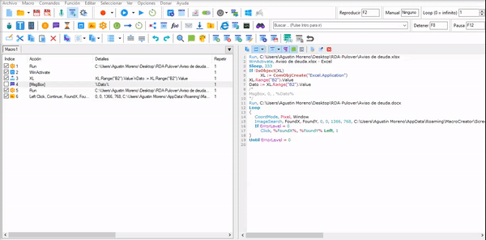
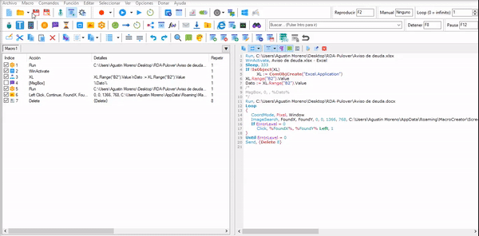

# Que es Pulover Macro Creator?
Is a Free Automation Tool and Script Generator. It is based on AutoHotkey language and provides users with multiple automation functions, as well as a built-in recorder.
Sites: https://www.macrocreator.com/

## Objetivo
automatizar la transferencia de datos desde Excel a word.

# Step by Step

## Abrir Excel.
Con el Boton Run, podemos ejecutar el excel seleccionado

## WinActivate
Para que la ventana este activa siempre usamos WinActivate.

## Conectar macro con  Excel.
Para interactuar con el excel y sacar los datos, tenemos que Relacionarlo.
En este ejemplo se ve como relacionarlo y como extraer el nombre.
Pasos:
  1. Vamos a Funciones.
  2. En Salida Variable escribimos **XL**.
  3. En Nombre de la funcion seleccionamos **ComObjActive**.
  4. En Parametros escribimos (con comillas) **"Excel.Application** y presionamos aceptar.
  
  5. Vamos al boton COM INTERFACE.
  6. Click en check 'Creacion automatica de objetos COM'
  7. En 'Manejar' escribimos **XL**.
  8. En 'CLSID' Buscamos la opcion **"Excel.Application"**
  9. Presionamos el boton de conectar. Pulover se minimiza, buscas el excel y cuando el cursor este sobre el excel donde extraeras los       datos presionas click derecho, al presionarlo deberia salir una ventana que diga **Conexion Correcta**. 
    Si falla intentalo de nuevo y verifica que el excel sea el correcto o este dañado.
  6. En 'Expresion/COM INTERFACE' ponemos el valor de la celda, y lo guardamos en una variable.
     
     -**XL**: Es el nombre con el cual se relacion con el excel.
     
     -**Range("Columna y NumeroDeFila")**: 
     
     -**Value**: Obtiene el valor que tiene adentro de la celda.
     
     -**Dato**: es el nombre de la variable, puedes ponerle el nombre que quieras y adentro contendra el valor de la celda.
     Para llamar el valor de una variable lo usamos dentro de porcentaje %Dato%
     
     **Codigo de ejemplo**: 
     
     En este ejemplo toma el valor de una sola celda. Lo guarda dentro de una variable llamada **Dato**.
     
     
     ` Dato := XL.Range("B2").Value `
     
     
     Para tomar el valor de varias celdas tenemos que usar **Copy**, Pulover guarda los valores copiados en **Clipboard**.
     Luego en otra accion se invoca con el signo porcentaje **%Clipboard%** (al igual que una variable):.
     
     ` XL.Range("A2:B4").Copy` 
         
   
   7. Presionamos el boton 'Aplicar' y luego 'Aceptar'.
   
   Opcional: Si quieres ver el valor, puedes ir a Message Box, y escribes el nombre de la variable dentro de %nombre de Variable%

  
 ## Abrir Word
 Seleccionamos el Word de la misma manera que seleccionamos el excel anteriormente.
 
 
 ## Screenshot en el archivo del word.
 Para seleccionarnos en un texto, le sacamos un screenshot, seleccionamos la opcion 
 
 
 ## Insertar pulsaciones.
 Insertamos una accion del teclado, en este caso usamos el Supr. y la cantidad de veces que queres que sea presionado.
 
 
 ## Escribir el texto en el word.
 Escribiremos el texto, donde esta la variable guardada.
 

 
 
 
 
 

