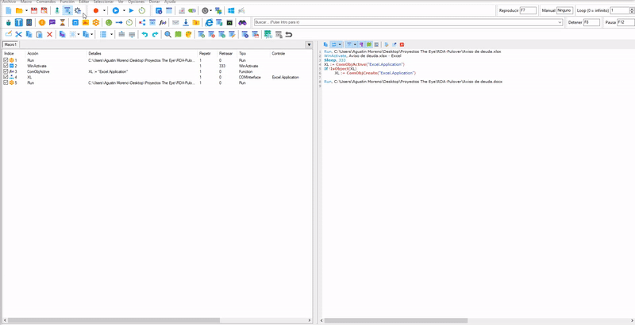

# Que es Pulover Macro Creator?
Is a Free Automation Tool and Script Generator. It is based on AutoHotkey language and provides users with multiple automation functions, as well as a built-in recorder.
Sites: https://www.macrocreator.com/

## Objective
Automate data transfer from Excel to word

# Step by Step

## Open Excel.
With the Run Button, we can execute the selected Excel

## WinActivate
So that the window is active we always use WinActivate.

## Conectar macro con  Excel.
To interact with the excel and get the data, we have to relate it.

Pasos:
  1. Let's go to Functions (Funciones).
  2. In Variable Output we write **XL**.
  3. In Function Name we select **ComObjActive**.
  4. Parameters we write (with quotes)**"Excel.Application** and press accept.
  5. Let's go to the button **COM INTERFACE**.
  6. Click in check 'Automatically Create COM OBJECT'
  7. In 'Handle' we wrote **XL**.
  8. In 'CLSID' We look for the option **"Excel.Application"**
  9. Press the connect button. Pulover is minimized, you look for the excel and when the cursor is on the excel where you will extract        the data you press right click, when pressing it you should leave a window that says **Connection Succesful!**. 
     If it fails, try again and verify that the excel is correct or damaged.
  10. In 'Expression/COM INTERFACE' we put the value of the cell, and save it in a variable.
     
     In this example, it takes the value of a single cell. It saves it within a variable called **Dato**.
     
     
     ` Dato := XL.Range("B2").Value `
     
     -**XL**: It is the name with which it relates to the excel.
     
     -**Range("Columna y NumeroDeFila")**: 
     
     -**Value**: Get the value it has inside the cell.
     
     -**Dato**: It is the name of the variable, you can put the name you want and it will contain the value of the cell.
      To call the value of a variable we use it as a percentage %Dato%
     
     To take the value of several cells we have to use **Copy**, Pulover saves the copied values in **Clipboard**.
      Then another action is invoked with the percent sign **%Clipboard% ** (as well as a variable) :.
     
     ` XL.Range("A2:B4").Copy` 
         
   
   11. Press the 'Ok' button.
   
   ##### Optional: If you want to see the value, you can go to Message Box, and write the name of the variable in %Variablename%

  
 ## Open Word
 We select the Word in the same way that we select the excel above.
 
 
 ## Screenshot in the word file.
 We can take screenshot to place ourselves in the text we need or in a button that when found it can click.
 
 
 _______________________________________________________________
 **Click to button with Screenshot**
 
 
 ## Insert keyboard actions.
 We insert a keyboard action, in this case we use the Delete and the number of times you want it to be pressed.
 
 
 ## Write the text in the word.
 We will write the text or we can use a variable. This way we can replace it.
 **Writing a text**
 
  _______________________________________________________________
  
 **Calling a variable that contains the data of a previously requested Excel cell**
 
 
 
 
 

 
 
 
 
 

