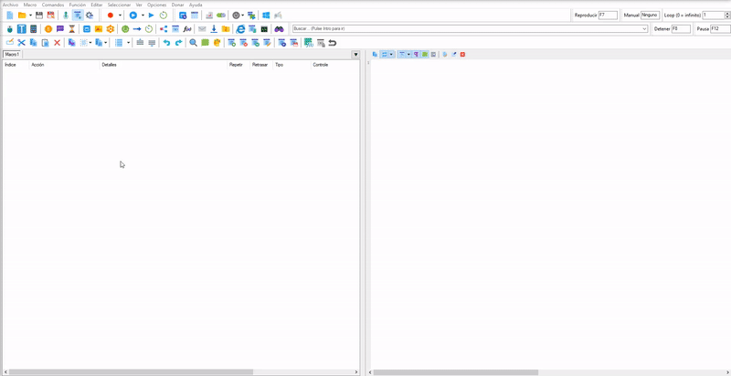
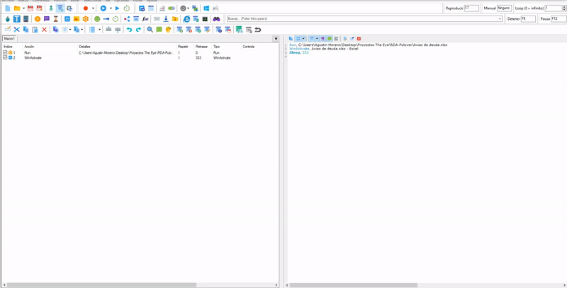
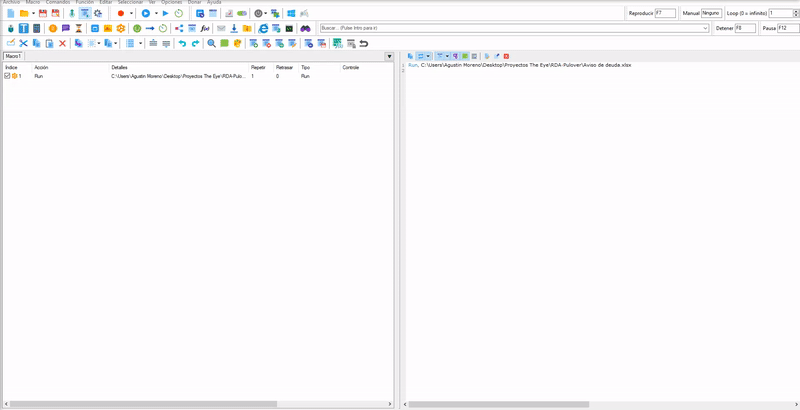
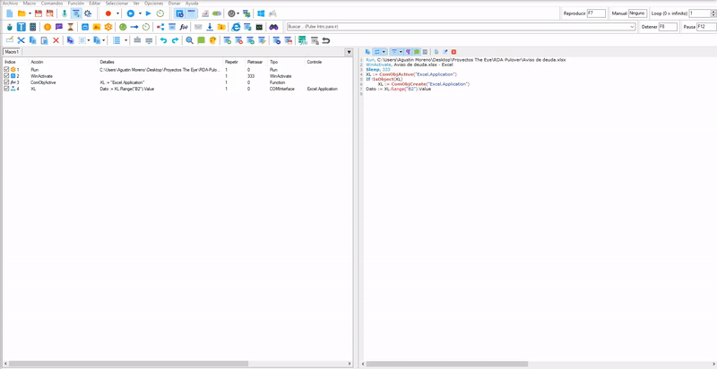
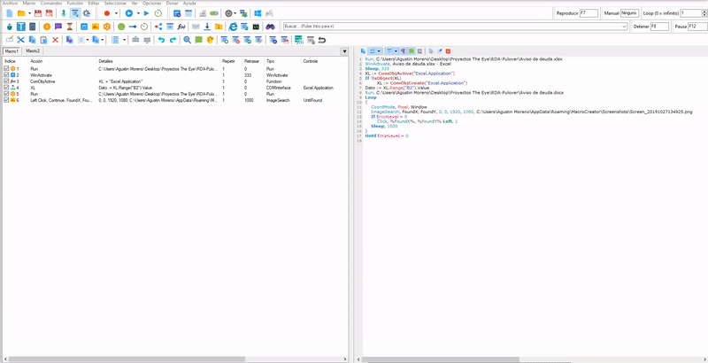
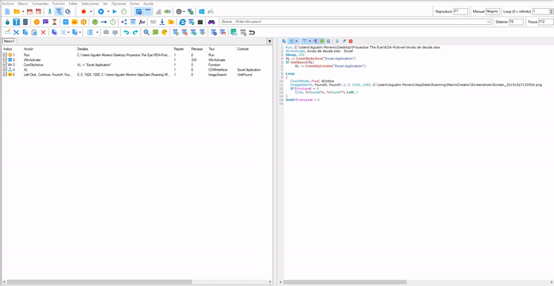
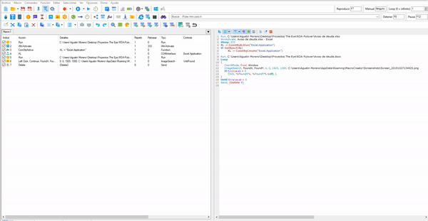
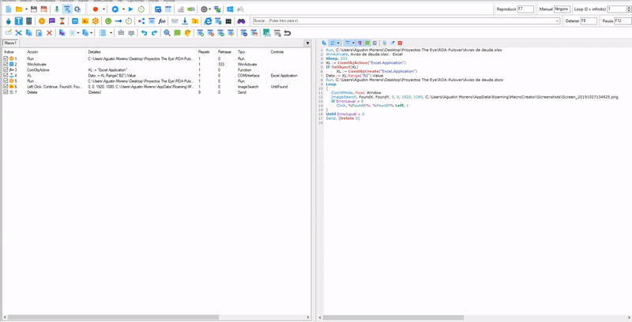

# What is Pulover Macro Creator?
Es una herramienta de automatización y generador de scripts. Se basa en el lenguaje AutoHotkey y proporciona a los usuarios múltiples funciones de automatización, así como un grabador incorporado.
Sitio: https://www.macrocreator.com/

## Objective
Completar la documentacion de word con los datos extraidos del excel, una vez completada la documentacion, enviarlo por mail al cliente correspondiente que figura en el excel.

# Step by Step

# Excel

## Open Excel.
Con el botón Run/Ejecutar, seleccionamos el excel desde **target** y en el command seleccionamos **run**

## Connect macro with Excel.
Para que nuestra macro pueda extraer los datos del excel, tenemos que relacionarlo siguiendo estos pasos.

Steps:
  1. Vamos a Funciones(Functions).
  2. En Variable Output escribiremos **XL**.
  3. En Function Name seleccionamos **ComObjActive**.
  4. En Parámetros escribimos (con comillas) **"Excel. Aplicación** y presionamos aceptar.
  5. Vamos al boton **COM INTERFACE**.
  6. Click en check 'Automatically Create COM OBJECT'
  7. En 'Handle' escribimos **XL**.
  8. En 'CLSID' buscamos la opcion **"Excel.Application"**
  9. Ppresione el botón de conexión. Pulover está minimizado, tienes que buscar el excel que quieres usar, al encontrarlo presiona click 
  derecho (Como podemos ver en el gif), al presionarlo debe salir de una ventana que dice **Connection Succesful!**. 
  Si falla intenta conectarlo de nuevo o verifica que el excel no este dañado.
  10. En 'Expression/COM INTERFACE' Ponemos el valor de la celda y lo guardamos en una variable.
     
  En este ejemplo, toma el valor de una sola celda. Lo guarda dentro de una variable llamada **Dato**.
     
     
     ` Dato := XL.Range("B2").Value `
     
       
  -**XL**: Es el nombre con el que se relaciona con el excel.
  -**Range("Columna y NumeroDeFila")**:    
  -**Value**: Obtenga el valor que tiene dentro de la celda.
  -**Dato**: Es el nombre de la variable, puede poner el nombre que desee y contendrá el valor de la celda.
  Para llamar el valor de una variable lo usamos como un porcentaje% Dato%
     
  Para tomar el valor de varias celdas tenemos que usar ** Copiar **, Pulover guarda los valores copiados en ** Portapapeles **.
  Luego se invoca otra acción con el signo de porcentaje **% Portapapeles% ** (así como una variable):.
     
     ` XL.Range("A2:B4").Copy` 
         
   
   11. Presione el botón 'Ok'.
   
   ##### Opcional: si desea ver el valor, puede ir a **Message Box** y escribir el nombre de la variable de este modo %Nombre de variable%

  
## WinActivate
So that the window is active we always use WinActivate.

# WORD

 ## Open Word
 We select the Word in the same way that we select the excel above.
 
 
 ## Reemplazar 
 Microsoft Word tiene una opcion para reemplazar palabras, que podemos llamarlo con la combinacion de tecla *CTRL+L*
 COLOCAR IMAGEN DE MUESTRA
 
 Pulover tiene una opcion para que puedas usar una combinacion de teclado como vimos anteriormente. 
 Pulsamos las teclas que queremos usar en nuestra macro.
 GIF TECLA

 
 
 _______________________________________________________________
 **Click to button with Screenshot**
 
 
 ## Insert keyboard actions.
 We insert a keyboard action, in this case we use the Delete and the number of times you want it to be pressed.
 
 
 ## Write the text in the word.
 We will write the text or we can use a variable. This way we can replace it.
 **Writing a text**
 
  _______________________________________________________________
  
 **Calling a variable that contains the data of a previously requested Excel cell**
 
 
 
 
 

 
 
 
 
 

