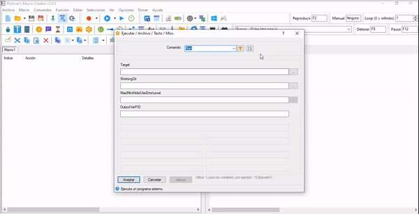

# Que es Pulover Macro Creator?
Is a Free Automation Tool and Script Generator. It is based on AutoHotkey language and provides users with multiple automation functions, as well as a built-in recorder.
Sites: https://www.macrocreator.com/

## Objetivo
automatizar la transferencia de datos desde Excel a word.

# Step by Step

## Abrir Excel.
Una vez que abrimos un archivo nuevo, seleccionamos el excel para que corra en la macro.

## WinActivate
Antes de realizar alguna accion, es recomendable que la ventana del programa (Excel en este caso), no este minimizada.
Una vez que busquemos el excel, presionar click derecho para seleccionarlo.

## Conectar macro con  Excel.
Para interactuar con el excel y sacar los datos,tenemos que conectarlo.
En este ejemplo se ve como relacionarlo y como extraer el nombre.
Pasos:
  1. Vamos al boton COM INTERFACE.
  2. Click en check 'Creacion automatica de objetos COM'
  3. En 'Manejar' ingresamos "XL" (o el nombre que quieras ingresar para relacionarlo con el excel)
  4. En 'CLSID' Buscamos la opcion "Excel.Application"
  5. Presionamos el boton de conectar. Pulover se minimiza, buscas el excel y cuando el cursor este sobre el excel donde extraeras los       datos presionas click derecho, al presionarlo deberia salir una ventana que diga "Conexion Correcta". Si falla intentalo de nuevo y       verifica que el excel sea el correcto o este dañado.
  6. En 'Expresion/COM INTERFACE' ponemos el valor de la celda, y lo guardamos en una variable.
     
     -**XL**: Es el nombre con el cual se relacion con el excel.
     
     -**Range("Columna y NumeroDeFila")**
     
     -**Value**: es el valor que contiene adentro de la celda.
     
     -**Dato**: es el nombre de la variable, puedes ponerle el nombre que quieras y adentro contendra el valor de la celda.
     
     **Codigo de ejemplo**: 
     
     ` XL.Range("B2").Value `      
     ` Dato := XL.Range("B2").Value `

   
   
   7. Presionamos el boton 'Aplicar' y luego 'Aceptar'.
   Opcional: Si quieres ver el valor, puedes ir a Message Box, y escribes el nombre de la variable dentro de %nombre de Variable%

  
 ## Abrir Word
 Seleccionamos el Word de la misma manera que el excel.
 
 
 ## Screenshot en el archivo del word.
 Usamos el screenshot en el texto que nos queremos posicionar, borramos el contenido y escribimos el valor del excel extraido          
 anteriormente. Para borrarlo usaremos un loop (para repetir la misma accion X cantidad de veces).
 En el gif, muestra un ejemplo de como seleccionar el texto que queremos modificar manteniendo click izquierdo.
 
 
 ## Insertar pulsaciones.
 Insertamos una accion del teclado, en este caso usamos el Supr. y la cantidad de veces que queres que sea presionado.
 
 
 ## Escribir el texto en el word.
 Escribiremos el texto, donde esta la variable guardada.
 

 
 
 
 
 

